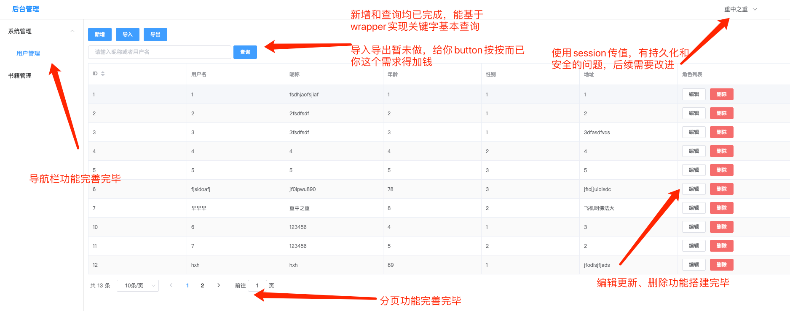
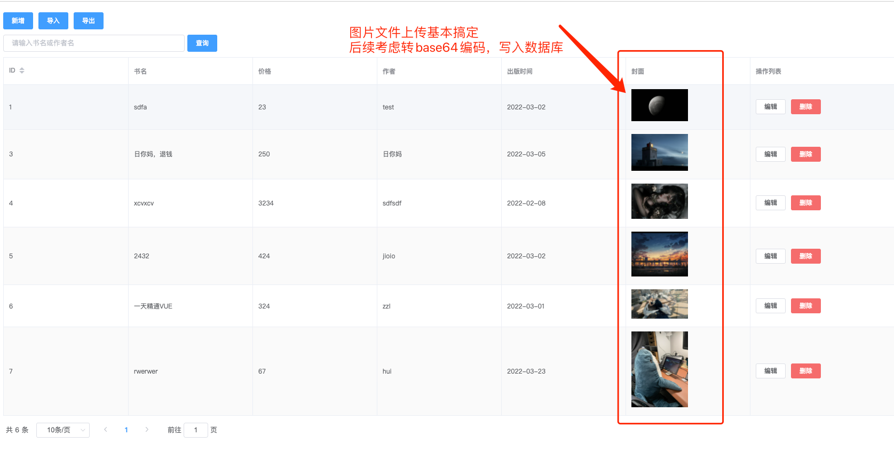

#目录
[TOC]

#服务调试
### springboot_vue_test

## Project setup
#### cd 进入项目文件夹，使用如下命令
```
npm install
```

#### 安装完后使用如下命令开启前端网页
```
npm run serve
```

### 打包
```
npm run build
```

###后端调试：
导入maven项目，刷新、clean、install，等待安装所有依赖即可

#### Customize configuration
See [Configuration Reference](https://cli.vuejs.org/config/).


# update 2022-03-16 基本框架搭建完毕，实现了前后端分离，基本crud完成

# update 2022-03-17 基本实现所有基础功能的搭建


##bug以及需要改进的问题
-[ ] 1、右上角用户名持久化<br>
-[ ] 2、图片写入数据库<br>
-[ ] 3、富文本编辑器继承<br>
-[ ] 4、数据权限控制<br>
-[ ] 5、 云服务器部署<br>
-[ ] 6、验证码，多表查询<br>
-[ ] 7、支付宝沙箱支持<br>
